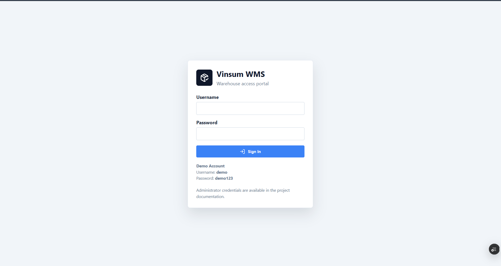
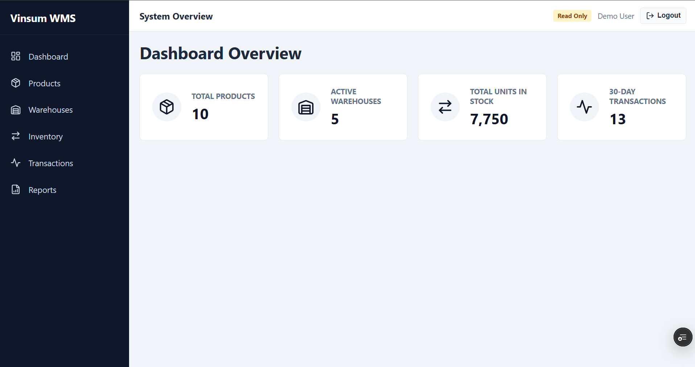
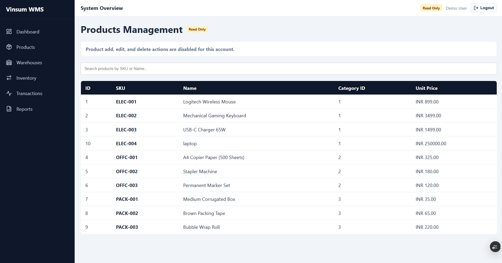
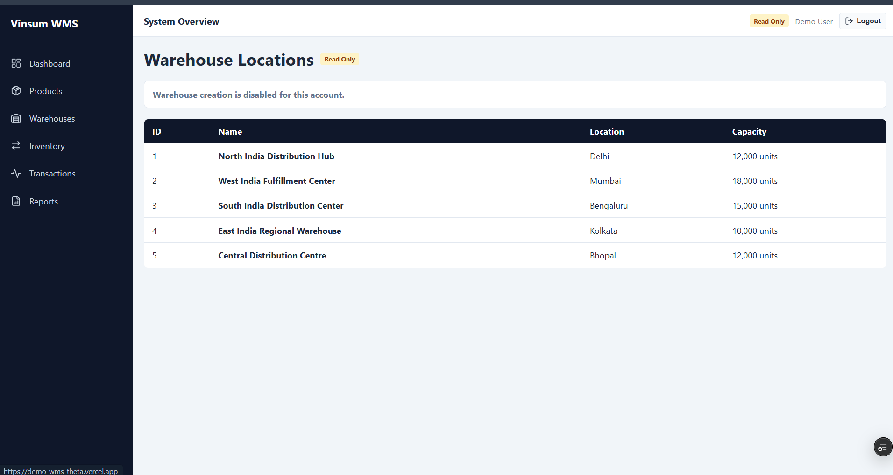
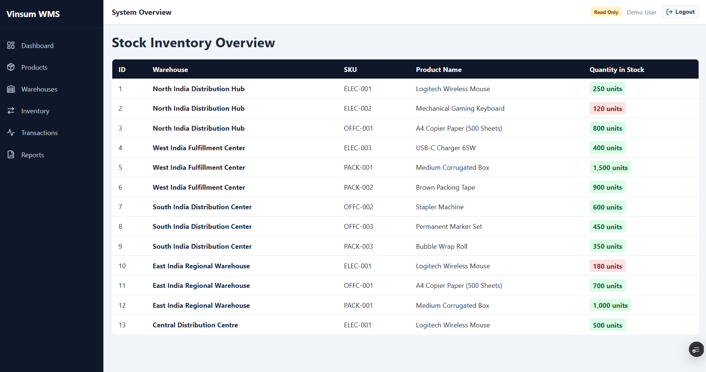
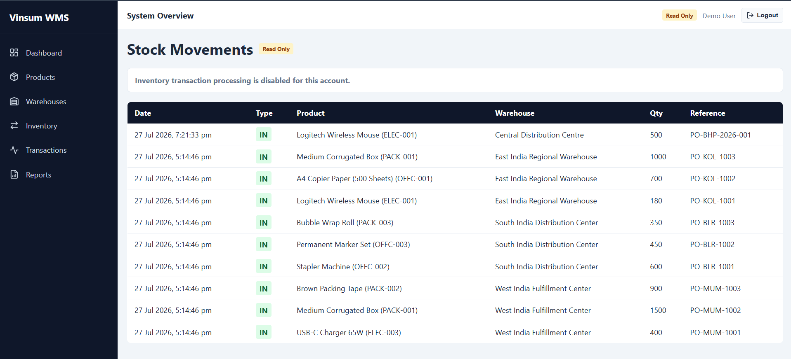
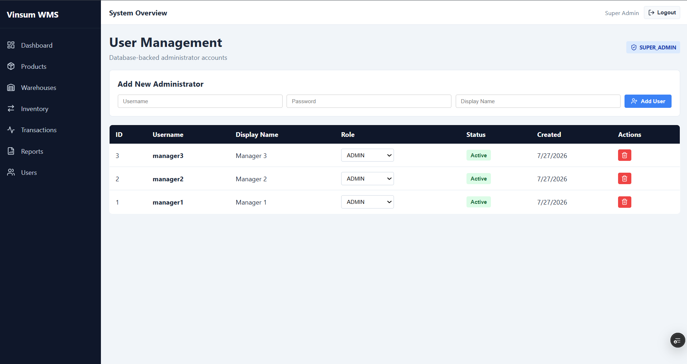
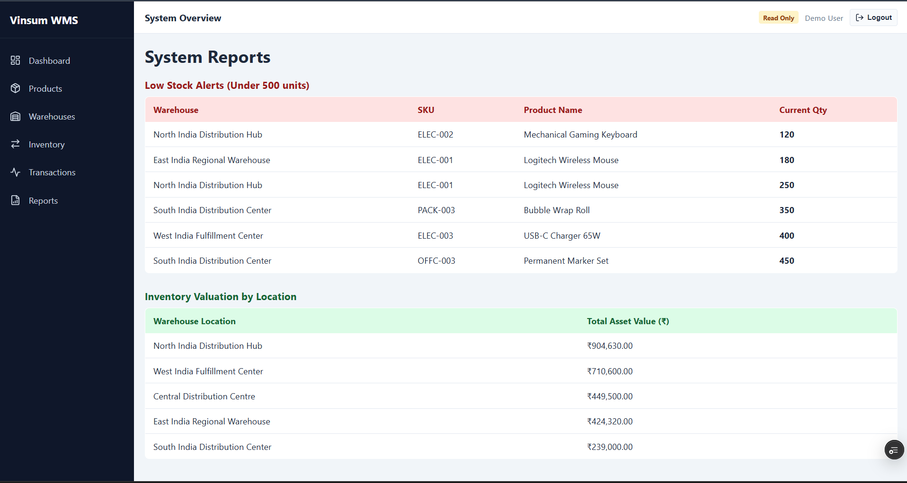

# Warehouse Management System (WMS)

A full-stack Warehouse Management System (WMS) developed to streamline warehouse operations, inventory management, stock movements, and user administration through a secure Role-Based Access Control (RBAC) system.

The project was developed as part of my internship at **VINSUM AXPRESS India Pvt. Ltd.**, inspired by real-world enterprise warehouse management workflows.

---

## 🚀 Live Demo

**Application:**  
https://demo-wms-theta.vercel.app/login

---

## 📌 Features

### Inventory Management
- Real-time inventory tracking
- Multi-warehouse inventory support
- Product catalog management
- Warehouse management
- Inventory valuation and stock overview

### Stock Transactions
- Stock In (Receiving)
- Stock Out (Dispatch)
- Inventory Adjustments
- Automatic inventory updates
- Transaction history and audit trail

### Reports & Dashboard
- Live inventory statistics
- Warehouse-wise inventory summary
- Low stock alerts
- Inventory asset valuation

### Authentication & Authorization
- Secure JWT Authentication
- Role-Based Access Control (RBAC)
- Super Admin
- Administrator
- Demo User

### User Management
- Create users
- Update user details
- Enable/Disable users
- Assign roles
- Delete users

---

## 👥 User Roles

| Role | Permissions |
|------|-------------|
| **SUPER_ADMIN** | Full system access including User Management |
| **ADMIN** | Manage products, warehouses, inventory and transactions |
| **DEMO_USER** | Read-only access for demonstration purposes | 

---

## 🛠️ Tech Stack

### Frontend
- React
- Vite
- React Router
- Axios

### Backend
- Node.js
- Express.js
- JWT Authentication

### Database
- Microsoft SQL Server
- Azure SQL Database

### Deployment
- Vercel (Frontend)
- Render (Backend)
- Azure SQL Database

---

## 📂 Project Structure

```text
demo-wms/
|
|-- database/
|   |-- Debug_1.sql
|   |-- queries.sql
|   |-- schema.sql
|   `-- seed.sql
|
|-- images/
|   |-- dashboard.png
|   |-- inventory.png
|   |-- prod_mgmt.png
|   |-- reports.png
|   |-- transaction.png
|   |-- user_mgmt.png
|   `-- warehouse.png
|
|-- wms-backend/
|   |-- src/
|   |   |-- config/
|   |   |   `-- db.js
|   |   |-- controllers/
|   |   |   |-- authController.js
|   |   |   |-- dashboardController.js
|   |   |   |-- inventoryController.js
|   |   |   |-- productController.js
|   |   |   |-- reportController.js
|   |   |   |-- transactionController.js
|   |   |   |-- userController.js
|   |   |   `-- warehouseController.js
|   |   |-- middleware/
|   |   |   |-- authMiddleware.js
|   |   |   `-- errorHandler.js
|   |   |-- models/
|   |   |   |-- dashboardModel.js
|   |   |   |-- inventoryModel.js
|   |   |   |-- productModel.js
|   |   |   |-- reportModel.js
|   |   |   |-- transactionModel.js
|   |   |   |-- userModel.js
|   |   |   `-- warehouseModel.js
|   |   |-- routes/
|   |   |   |-- authRoutes.js
|   |   |   |-- dashboardRoutes.js
|   |   |   |-- inventoryRoutes.js
|   |   |   |-- productRoutes.js
|   |   |   |-- reportRoutes.js
|   |   |   |-- transactionRoutes.js
|   |   |   |-- userRoutes.js
|   |   |   `-- warehouseRoutes.js
|   |   |-- services/
|   |   |-- utils/
|   |   `-- server.js
|   |-- .env
|   |-- .gitignore
|   |-- package-lock.json
|   `-- package.json
|
|-- wms-frontend/
|   |-- src/
|   |   |-- assets/
|   |   |-- components/
|   |   |   |-- common/
|   |   |   |   `-- ProtectedRoute.jsx
|   |   |   `-- layout/
|   |   |       `-- MainLayout.jsx
|   |   |-- context/
|   |   |   `-- AuthContext.jsx
|   |   |-- hooks/
|   |   |-- pages/
|   |   |   |-- Dashboard.jsx
|   |   |   |-- Inventory.jsx
|   |   |   |-- Login.jsx
|   |   |   |-- Products.jsx
|   |   |   |-- Reports.jsx
|   |   |   |-- Transactions.jsx
|   |   |   |-- UserManagement.jsx
|   |   |   `-- Warehouses.jsx
|   |   |-- services/
|   |   |   `-- api.js
|   |   |-- utils/
|   |   |-- App.jsx
|   |   |-- index.css
|   |   `-- main.jsx
|   |-- .env
|   |-- .gitignore
|   |-- index.html
|   |-- package-lock.json
|   |-- package.json
|   |-- vercel.json
|   `-- vite.config.js
|
|-- original_structure.txt
|-- Project_Roadmap.md
|-- README.md
`-- structure.txt
```

---

## ⚙️ Getting Started

### Clone the Repository

```bash
git clone https://github.com/manavb-21/demo-wms
```

### Backend

```bash
cd wms-backend
npm install
npm start
```

### Frontend

```bash
cd wms-frontend
npm install
npm run dev
```

---

## 📸 Screenshots

- Login

- Dashboard

- Products

- Warehouses

- Inventory

- Transactions

- User Management

- Reports


---

## 🌟 Key Highlights

- Full-stack warehouse management application
- Secure authentication using JWT
- Role-Based Access Control (RBAC)
- Microsoft SQL Server integration
- Cloud deployment using Azure SQL, Render and Vercel
- Responsive user interface
- Production-ready architecture

---

## 📖 Learning Outcomes

This project provided practical experience in:

- Full-stack web development
- REST API development
- Authentication & Authorization
- Database design and integration
- Inventory management workflows
- Cloud deployment
- Enterprise software architecture
- Version control using Git & GitHub

---

## 📄 License

This project was developed for educational and learning purposes.
